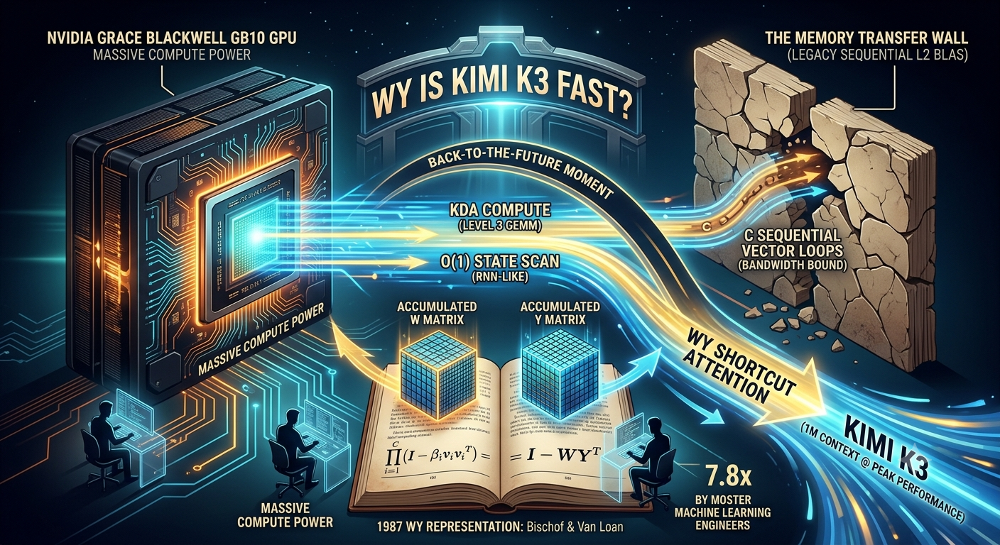

# WY is Kimi K3 Fast?

This article explains why (or rather WY) the Kimi K3 model is so fast.

It is well known that the bottle neck for intelligent systems is computing "Attention" - the heart of how a LLM figures out the nuance and relationship between words (tokens).

Kimi K3 uses Kimi Delta Attention.  But why is it so fast?

## Chipping a bit off

Let us take a mathematical analogy.  Suppose you have 1 (or rather the unit matrix) and you multiply it by 1 lots of times.  It is easy to know the answer is 1 regardless of how many sequential multiplies you have done.  Infinite speed up.

Now let us take the unit matrix, and chip a little bit off.  Then multiply it by another unit matrix with a different little bit chipped off.  Well matrices of this form permit a shortcut.  Instead of lots of sequential multiplies, you can do two matrix multiplies that wrap up the whole job.  Those special matrices are the W and Y matrices.

Now coming up with these magic W and Y matrices is not easy, but is is easy for a GPU (math heavy, data light).  What is hard for a GPU is constantly shunting memory to and from the GPU.  This happens in the sequential case.  But in the shortcut case, you just shunt over the data once.

So this is the magic of WY the Kimi K3 model is so fast.  It is why the model can be served cheaply to customers.  It's all about the memory transfer wall and avoiding it.

## Deja Vu all over again

Ironically this work is not new.  Back in the 1980s CPUs were getting much faster than memory leading to bottlenecks with data transfers.  This is when the WY representation technique was developed.  40 years later, in a somewhat of a Back-to-the-Future moment, these old techniques find fresh enthusiasm amongst Machine Learning engineers because GPUs are nowadays super fast, and the memory that connects them the limiting factor.

I have written up a research report that reproduces the claims of the Kimi K3 research paper with a micro benchmark.  It really holds up!
